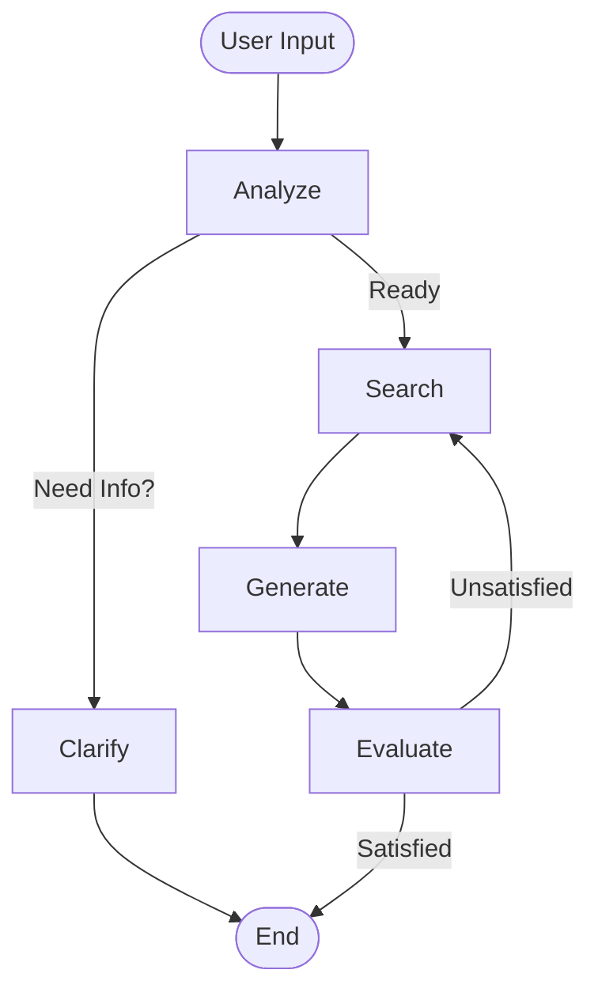

# A-TEAM Chatbot & Data Processing

본 문서는 A-TEAM의 법률 RAG 챗봇 아키텍처와 데이터 전처리 로직에 대해 기술합니다.

## 1. 시스템 아키텍처 (System Architecture)

### 1.1. 개요

`chatbot_graph_V8.py`는 **LangGraph**를 기반으로 한 상태 기반(Stateful) 에이전트 워크플로우를 구현합니다.

### 1.2. 계층 구조 (Layers)

- **Configuration**: `Config` 클래스에서 모든 설정(모델명, 임계값, 프롬프트 등)을 중앙 관리
- **Infrastructure**: 외부 리소스 연결 관리
  - **Vector Store**: Qdrant (HyDE / Semantic Search)
  - **Keyword Search**: BM25 (Lexical Search)
  - **Reranker**: Jina Reranker (Multilingual)
- **Logic**: 주요 노드별 비즈니스 로직
  - `Analyze`: 질문 의도 및 유형 분석
  - `Search`: HyDE + Hybrid Search + Reranking + Boosting
  - `Generate`: Context 기반 답변 생성 (Chain of Thought)
  - `Evaluate`: 답변 품질 평가
- **Execution**: 그래프 컴파일 및 실행

### 1.3. 데이터 흐름 (Workflow)

1. **Analyze**: 사용자 질문을 분석하여 `intent_type`(법령조회/판례검색 등)과 `category`(노동/민사 등)를 파악합니다.
2. **Clarify**: 질문이 너무 모호한 경우 명확화를 위한 역질문을 생성합니다.
3. **Search**:
   - **Query Expansion**: LLM을 사용하여 **HyDE(가상 답변)** 및 **Keywords**를 생성합니다.
   - **Hybrid Retrieval**: Vector Search(Qdrant)와 Keyword Search(BM25) 결과를 결합합니다.
   - **Reranking**: Jina Reranker를 사용해 의미적 연관성 순으로 재정렬합니다.
   - **Filtering**: 관련 법령(`related_laws`)에 가중치를 부여하고, 유사도(`0.2`) 미만 문서를 필터링합니다.
4. **Generate**: 검색된 문서를 바탕으로 엄격한 증거 기반(Evidence-based) 답변을 생성합니다. Hallucination 방지를 위해 출처를 명시합니다.
5. **Evaluate**: 생성된 답변의 정확성과 문서 인용 여부를 평가하여, 기준 미달 시 재검색을 수행합니다.

---

## 2. 데이터 전처리 (Data Preprocessing)

### 2.1. 법령 데이터 (`preprocesser_법령.py`)

- **대상 파일**: `rd_노동법.json`, `rd_민사법.json`, `rd_형사법.json`
- **전처리 로직**:
  - **HTML 정제**: 불필요한 태그 제거 및 `<개정 2021. 1. 5.>` 형태를 `[개정 2021.1.5]`로 간소화.
  - **헤더 정규화**: `부 칙` -> `부칙`, `별 표` -> `별표` 등의 공백 정규화.
- **청킹 및 구조화**:
  - **조문 (Article)**: 각 조문을 기본 청크 단위로 합니다.
    - 내용이 **500자**를 초과할 경우, **100자 Overlap**을 적용하여 분할합니다.
  - **별표 (Table)**: 텍스트 길이가 **300자** 미만인 경우 해당 조문에 **병합**하여 문맥을 보존하고, 그 이상인 경우 독립된 청크로 분리합니다.
  - **부칙**: 최신 부칙만 유지하여 처리합니다.

### 2.2. 법령 외 데이터 (`preprocesser_법령외.py`)

- **대상 파일**: 주요판정사례, 행정해석, 판정선례, 고용노동부 Q&A
- **텍스트 구조화 (Context Reconstruction)**:
  - 단순 텍스트 나열이 아닌, "질문-답변" 구조를 하나로 묶어 문맥을 유지합니다.
  - **주요판정사례**: `[제목] \n 판정사항: ... \n 판정요지: ...`
  - **행정해석/Q&A**: `[제목] \n 질의: ... \n 답변: ...`
  - **판정선례**: `[제목] \n [질의] ... \n [회신] ... \n [관련법령] ...`
- **벡터화 시 후처리 (`vectorize_to_qdrant_결정선례.py`)**:
  - 전처리된 텍스트가 Qdrant에 저장되기 전, 너무 긴 문서(예: 판정선례)는 **800자 Chunk / 100자 Overlap**으로 다시 분할되어 저장됩니다.

---

## 3. 트러블슈팅 (Troubleshooting & Challenges)

프로젝트 진행 과정에서 마주친 주요 기술적 난관과 이를 해결하기 위한 시도들입니다.

### 3.1. 청킹(Chunking) 시 법령 컨텍스트 소실 문제

- **문제점**: 초기에는 단순 조항 단위로 텍스트를 분할했습니다. 이로 인해 청크만 보았을 때 해당 조항이 "근로기준법"인지 "노동조합법"인지 식별하기 어려워, 검색 정확도가 떨어지는 현상이 발생했습니다.
- **해결**: 각 청크의 맨 앞에 **`[법령명] 제N조(제목)` 형태의 헤더를 강제로 추가**했습니다. 이를 통해 Embedding 모델이 해당 텍스트가 어떤 법령에 속하는지 명확히 인지하게 되어 검색 성능이 크게 향상되었습니다.

### 3.2. 평가 데이터셋(Golden Dataset)의 품질 이슈

- **문제점**: 초기 생성된 평가용 질문(Question)들이 사람이 묻는 자연스러운 질문이 아니라, 법조문의 문장을 그대로 비틀거나 지나치게 예외적인 상황만을 다루는 경우가 많았습니다. 이로 인해 Ragas 등의 평가 점수(Faithfulness, Relevance 등)를 신뢰할 수 없었습니다.
- **시도**: "일반인이 질문하는 듯한 구어체"와 "구체적인 위반 상황"을 프롬프트에 명시하여 데이터셋을 재생성했습니다.

### 3.3. 유사 조항 간의 의미적 혼동

- **문제점**: 품질이 개선된 데이터셋으로 실험했을 때, 모델이 법령의 내용은 유지하지만 **의미론적으로 매우 유사한 다른 조항**을 정답으로 가져오는 문제가 발생했습니다. (예: 해고 예고와 해고 사유 제한은 다르지만, '해고'라는 맥락에서 벡터 유사도가 높게 잡힘)
- **분석**: 법률 데이터 특성상, 용어가 겹치면 문맥이 달라도 벡터값이 가깝게 위치하는 한계가 있었습니다. 이를 해결하기 위해 Reranker를 도입했으나 완벽하게 해결되지는 않았습니다.

### 3.4. 검색 성능(Retrieval Performance)의 한계

- **난관**: HyDE, Query Expansion, Hybrid Search, Reranking 등 다양한 SOTA 기법들을 적용했음에도 불구하고, "어떻게 하면 정확한 문서를 **100%** 찾아올 것인가"에 대한 명쾌한 해결책(Silver Bullet)을 찾지 못했습니다.
- **결론**: 법률 도메인에서는 단순 검색을 넘어, 질문의 의도를 파악해 '관련 법령'을 먼저 특정하고 필터링하는 **Metadata Filtering** 전략이 필수적임을 깨달았습니다.
